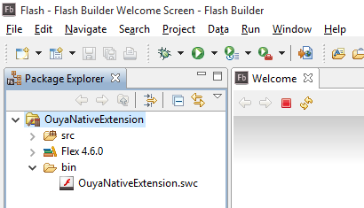
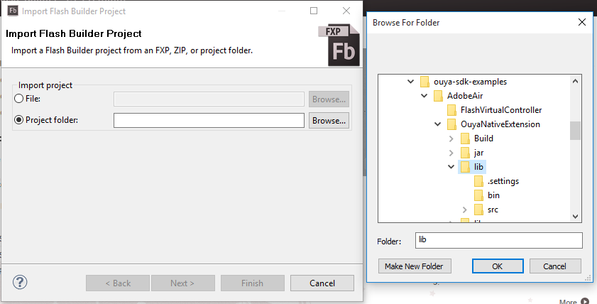
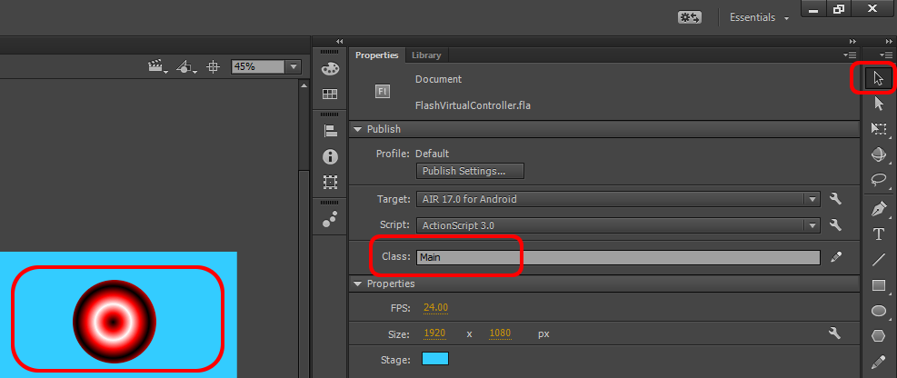
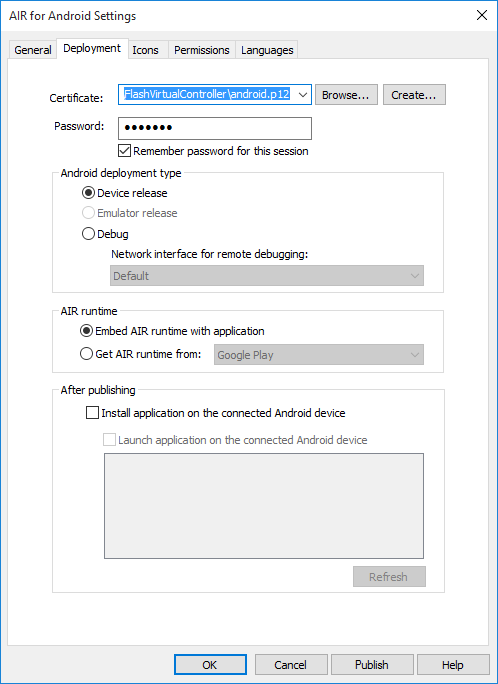
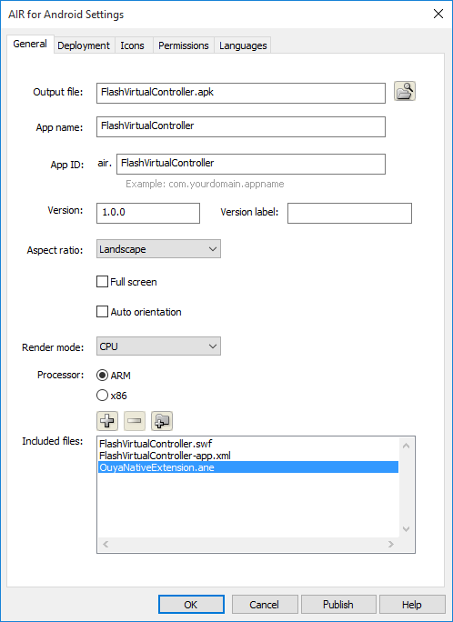
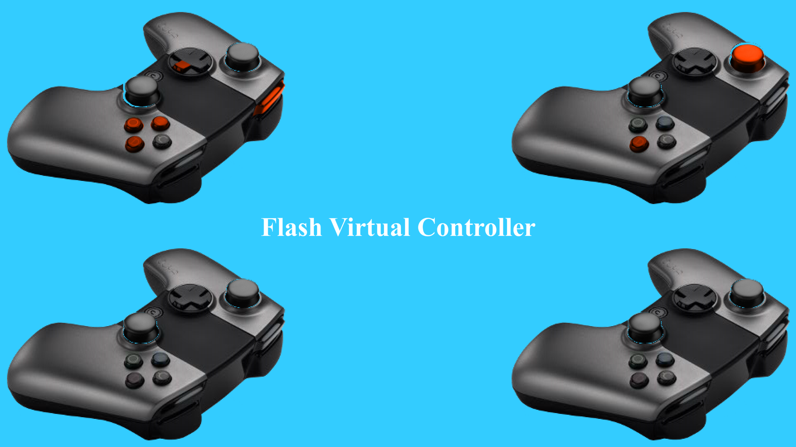

## Adobe Air Engine

### Downloads
Open source, clone https://github.com/ouya/ouya-sdk-examples/tree/master/AdobeAir

### Forums

@OUYA - (Adobe Air on OUYA Forums) - http://forums.ouya.tv/categories/adobe-air-on-ouya<br/>

## Guide

### Videos

* Packaging ANE/SWC/ZIP extensions in FlashDevelop - https://vimeo.com/32551703

* Android Native Extensions - Part 1 - http://gotoandlearn.com/play.php?id=148

* Android Native Extensions - Part 2 - http://gotoandlearn.com/play.php?id=149

### Resources

* Adobe Air SDK - http://www.adobe.com/devnet/air/air-sdk-download.html

* FlashDevelop - IDE - http://www.flashdevelop.org/

* FlashBuilder - http://www.adobe.com/products/flash-builder.html

* Flixel - Open source game-making library - http://flixel.org  

* Quick Guide to Creating and Using SWC - http://dev.tutsplus.com/tutorials/quick-guide-to-creating-and-using-swcs--active-1211

* ANEBUILDER - http://as3breeze.com/anebuilder/

* ANE-Wizard - https://github.com/freshplanet/ANE-Wizard

# FlashDevelop/Flex/AdobeAirSDK

When compiling `FlashDevelop`, `Flex`, and the `AdobeAirSDK` you'll want to increase your Java Virtual Machine memory size. Normally the default is `384MB` but you can increase to `1GB` or higher ```java.args=-Xmx1024m```.

There are several locations where the `jvm.config` is configured.

```
C:\Users\[username]\AppData\Local\FlashDevelop\Apps\flexairsdk\4.6.0+16.0.0\bin\jvm.config
C:\Program Files\Adobe\Adobe Flash Builder 4.7 (64 Bit)\sdks\3.6.0\bin\jvm.config
C:\Program Files\Adobe\Adobe Flash Builder 4.7 (64 Bit)\sdks\4.6.0\bin\jvm.config
```

* The [FlashDevelop FAQ](http://www.flashdevelop.org/wikidocs/index.php?title=F.A.Q) needs your `JAVA_HOME` to point the `JDK6` (32-bit). 

# Building ANE

ANE Extensions wrap Java libraries so they can be invoked from Adobe Air ActionScript.

## Build JAR

The Java JAR needs to be compiled first before it can be wrapped in an ANE Extension.

[Gradle](https://github.com/ouya/ouya-sdk-examples/tree/master/AdobeAir/OuyaNativeExtension/Build) will compile the Java Extension code into `AirOuyaPlugin.jar`.

```
gradlew clean build copyJar copyNativeArmeabi copyNativeArmeabiV7a copyNativeArmeabiX86
```

The `AirOuyaPlugin.jar` will output to the [jar](https://github.com/ouya/ouya-sdk-examples/tree/master/AdobeAir/OuyaNativeExtension/jar) extension folder.

The `jar` folder also contains `FlashRuntimeExtensions.jar` (from the AdobeAirSDK) and `ouya-sdk.jar` (from the ODK).

## ANE Extension Interface

The extension interface is the piece between Java and ActionScript and was created using a [FlashBuilder project](https://github.com/ouya/ouya-sdk-examples/tree/master/AdobeAir/OuyaNativeExtension/lib).

After the builder project has imported, `Adobe Builder` will auto compile the `SWC` file which is needed any time ActionScript is changed in the `ANE`.



1) In `Flash Builder` choose the `File->Import Flash Builder Project` menu item.


2) Choose `Project Folder`, browse to the `AdobeAir/OuyaNativeExtension/lib` folder, and click `OK`.



3) After making changes to `ActionScript` switch back to `Flash Builder` which will auto-generate a new `SWC` file.

4) Building the `ANE` from script will embed the `SWC` file.

## Build ANE

[build_ane.cmd](https://github.com/ouya/ouya-sdk-examples/blob/master/AdobeAir/OuyaNativeExtension/build_ane.cmd) will package the `OuyaNativeExtension.ane` on Windows. Be sure to customize the paths for `JDK` and `AIR_SDK` pointing at the `AdobeAirSDK` in the build script.

## Using ANE

The [OuyaNativeExtension.ane](https://github.com/ouya/ouya-sdk-examples/blob/master/AdobeAir/OuyaNativeExtension/OuyaNativeExtension.ane) should be used as a library after placing in the following folders in a FlashDevelop project.

```
lib\OuyaNativeExtension.ane
extension\release\OuyaNativeExtension.ane
```

For the debug extension folder, extract the contents of `OuyaNativeExtension.ane` into a subfolder named `OuyaNativeExtension.ane`.

```
extension\debug\OuyaNativeExtension.ane\catalog.xml
extension\debug\OuyaNativeExtension.ane\library.swf
```

### Edit `application.xml`

Add the `OuyaNativeExtension.ane` extension to your application's extensions.

```
  <extensions>
	<extensionID>tv.ouya.sdk.ouyanativecontext</extensionID>
  </extensions>
```

Add the ANE extension's `MainActivity` within the `application` section of the `application.xml`. This will be a second activity after the existing `Activity` block.

```
		<activity android:name="tv.ouya.sdk.MainActivity"
			android:theme="@android:style/Theme.Translucent.NoTitleBar"/>
``` 

# OUYA Native Extension

Import the packages to use the OUYA Native Extension.

```
import tv.ouya.console.api.OuyaController;
import tv.ouya.sdk.OuyaNativeInterface;
```

## OuyaInit

Initialize the `OuyaNativeInterface` to use OUYA-Everywhere Input. The `OuyaNativeExtension.ane` extension must be added to your project. 

```
trace( "Initialize OUYA Extension..." );
var ouyaNativeInterface:OuyaNativeInterface = new OuyaNativeInterface();
ouyaNativeInterface.OuyaInit();
```

## IsAnyConnected

`IsAnyConnected` will return `true` if any controllers are connected, otherwise `false`.

```
var anyConnected:Boolean = ouyaNativeInterface.IsAnyConnected();
```

## IsConnected

`IsConnected` will return `true` if the `playerNum` controller is connected.

```
var playerNum:int = 0;
var isConnected:Boolean = ouyaNativeInterface.IsConnected(playerNum);
```

## GetAxis

`GetAxis` will return the `Number` value for the supplied `playerNum` controller and `axis`.

```
var playerNum:int = 0;
var axis:int = OuyaController.AXIS_LS_X;
var val:Number = ouyaNativeInterface.GetAxis(playerNum, axis);
```

The supported `axis` values are below.

```
OuyaController.AXIS_LS_X
OuyaController.AXIS_LS_Y
OuyaController.AXIS_RS_X
OuyaController.AXIS_RS_Y
OuyaController.AXIS_L2
OuyaController.AXIS_R2
```

## GetAnyButton

`GetAnyButton` will return `true` if any controller is pressing the `button`.

```
var button:int = OuyaController.BUTTON_O;
var pressed:Boolean = ouyaNativeInterface.GetAnyButton(button);
```

The supported `button` values are below.

```
OuyaController.BUTTON_O
OuyaController.BUTTON_U
OuyaController.BUTTON_Y
OuyaController.BUTTON_A
OuyaController.BUTTON_L1
OuyaController.BUTTON_R1
OuyaController.BUTTON_L3
OuyaController.BUTTON_R3
OuyaController.BUTTON_DPAD_UP
OuyaController.BUTTON_DPAD_DOWN
OuyaController.BUTTON_DPAD_RIGHT
OuyaController.BUTTON_DPAD_LEFT
OuyaController.BUTTON_MENU
```

`BUTTON_MENU` should only be used with `ButtonDown` and `ButtonUp` events.

## GetAnyButtonDown

`GetAnyButtonDown` will return `true` if any controller detected a pressed event on the last frame for the `button`.

```
var button:int = OuyaController.BUTTON_O;
var pressed:Boolean = ouyaNativeInterface.GetAnyButtonDown(button);
```

## GetAnyButtonUp 

`GetAnyButtonUp` will return `true` if any controller detected a released event on the last frame for the `button`.

```
var button:int = OuyaController.BUTTON_O;
var released:Boolean = ouyaNativeInterface.GetAnyButtonUp(button);
```

## GetButton

`GetButton` will return `true` if the `playerNum` controller is pressing the `button`.

```
var playerNum:int = 0;
var button:int = OuyaController.BUTTON_O;
var pressed:Boolean = ouyaNativeInterface.GetButton(playerNum, button);
```

## GetButtonDown

`GetButtonDown` will return `true` if the `playerNum` controller detected a pressed event on the last frame for the `button`.

```
var playerNum:int = 0;
var button:int = OuyaController.BUTTON_O;
var pressed:Boolean = ouyaNativeInterface.GetButtonDown(playerNum, button);
```

## GetButtonUp

`GetButtonUp` will return `true` if the `playerNum` controller detected a released event on the last frame for the `button`.

```
var playerNum:int = 0;
var button:int = OuyaController.BUTTON_O;
var released:Boolean = ouyaNativeInterface.GetButtonUp(playerNum, button);
```

## ClearButtonStatesPressedReleased

`ClearButtonStatesPressedReleased` will clear the detected pressed and released states to allow detection for the next update frame.

```
ouyaNativeInterface.ClearButtonStatesPressedReleased();
```

## Examples

### Flash

The following steps setup the `Main.as` ActionScript file to load at start-up to initialize the `OUYA` native extension.

1) Switch to the `selection tool` and `left-click` on the stage to select the document.



2) In the `Property` window change the `Class` field to `Main` to reference the `Main.as`.

3) Also set the document size to `1920x1080`.

4) To the right of the `Class` field there's an edit button to open the existing `Main.as` or use the file menu to create a new `Main.as` action script document.

5) Create a bare-bones `Main` class. When the application starts, the first thing that will be called is the `Main` constructor.

```
package
{
    import flash.display.MovieClip;

    public class Main extends MovieClip
    {
        public function Main()
        {
		}
	}
}
```

6) Add code to load the `OUYA` native extension and save a reference to the native interface.

```
package
{
    import flash.display.MovieClip;
	import tv.ouya.sdk.OuyaNativeInterface;

    public class Main extends MovieClip
    {
		// reference to the native interface
		var _mOuyaNativeInterface: OuyaNativeInterface;

        public function Main()
        {
			// create the native interface and initialize the OUYA native extension
			_mOuyaNativeInterface = new OuyaNativeInterface();

			// initialize the OUYA plugin
			_mOuyaNativeInterface.OuyaInit();
		}
	}
}
```

7) Open the `File->Air 17.0 for Android Settings` menu item.


8) On the `Deployment` tab, the `Certificate` field must be set. You can either browse to an existing `p12` certificate or create one with the `Create` button. This field must be set before clicking the `Publish` button. If `Remember password for this session` is set you can publish directly from the `File->Publish` menu item. Publishing will produce an `APK` file which can be installed on the command-line. All the `Flash` examples use `android` for the certificate password.

`adb install -r application.apk`



9) On the `General` tab, the `App ID` field should match the `package identifier` that was created in the [developer portal](http://devs.ouya.tv). Notice that `Adobe-Air` apps are always prefixed with `air`.



10) Select the `ARM` processor and click the `+` button to browse to the `OuyaNativeExtension.ane` copied to your project folder and click `OK`.

11) When publishing the `extensions` section will automatically appear in your project's `ApplicationName-app.xml` file and that section cannot be edited manually.

```
  <extensions>
    <extensionID>tv.ouya.sdk.ouyanativecontext</extensionID>
  </extensions>
```

11) Edit your project's `ApplicationName-app.xml` to add the following manifest additions.

```
<application xmlns="http://ns.adobe.com/air/application/17.0">
	<android> 
		  <manifestAdditions>
		  <![CDATA[
				<manifest>
					<uses-permission android:name="android.permission.WAKE_LOCK" />
					<application>
						<activity>
							<intent-filter>
								<action android:name="android.intent.action.MAIN"/>
								<category android:name="android.intent.category.LAUNCHER"/>
								<category android:name="tv.ouya.intent.category.GAME"/>
							</intent-filter>
						</activity>
						<activity android:name="tv.ouya.sdk.MainActivity"
							android:theme="@android:style/Theme.Translucent.NoTitleBar">
							<intent-filter>
								<category android:name="android.intent.category.DEFAULT" />
							</intent-filter>
						</activity>					
					</application>
				</manifest>
			]]>
		</manifestAdditions>
	</android> 	
```

### Flash Virtual Controller

The [Flash Virtual Controller](https://github.com/ouya/ouya-sdk-examples/tree/master/AdobeAir/FlashVirtualController) example shows 4 images of the OUYA Controller which moves axises and highlights buttons when the physical controller is manipulated.



### Community Supported Examples

Head on over to GaslightGames implementation for:<br/>

- Controllers

- In App Purchases

https://github.com/gaslightgames


Using Adobe AIR to create OUYA games:<br/>
http://zehfernando.com/2013/using-adobe-air-to-create-ouya-games/
