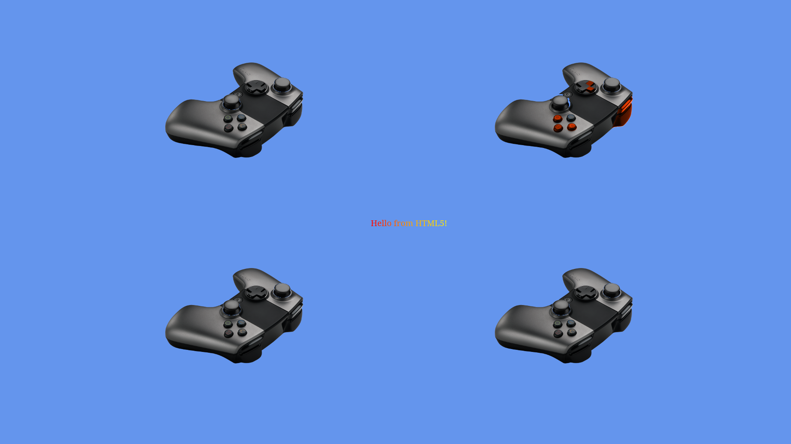
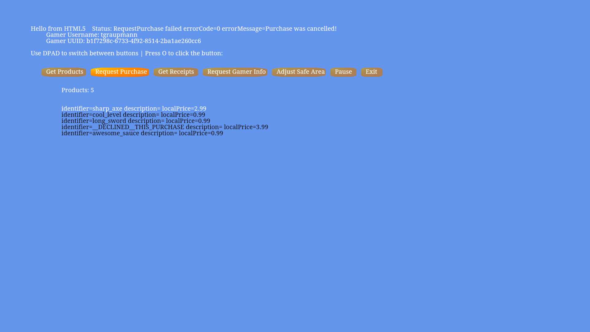

# Cordova

The [`Cordova`](https://cordova.apache.org/) engine provides a hardware-accelerated wrapper around HTML5.

## Resources

* [Cordova Android Platform Guide](http://cordova.apache.org/docs/en/5.0.0/guide_platforms_android_index.md.html)

* [Cordova Command-Line-Interface Guide](http://cordova.apache.org/docs/en/5.0.0/guide_cli_index.md.html#The%20Command-Line%20Interface)

* [Cordova Android Plugins](http://cordova.apache.org/docs/en/5.0.0/guide_platforms_android_plugin.md.html#Android%20Plugins)

## Cordova Command-Line Interface

1) Before the `Cordova` projects can be created, be sure to install the [`Cordova` Command-Line Interface](http://cordova.apache.org/docs/en/5.0.0/guide_cli_index.md.html#The%20Command-Line%20Interface).

2) Install [`Node.js`](https://nodejs.org/).

On Windows, `Node.js` can be installed from an `MSI` installer and be sure to add 'Node and npm' to the path.


3) Be sure to install a `GIT` source-control client. `Cordova` will report errors if `git` is missing from the path.


4) Open a new terminal to install `Cordova` globally.

On Mac:

```
sudo npm install -g cordova
```

On Windows:

```
npm install -g cordova
```


## HTML5

To interact with Cordova plugins, first add `Cordova` includes in the `head`.

```
    <script type="text/javascript" src="cordova.js"></script>
    <script type="text/javascript" src="js/index.js"></script>
```

### Input

Register the `Cordova` input hooks to receive `HTML5` input.

```
	function onLoad() {

      	if (cordova.exec == undefined) {
      		onFailure(0, "Wait for plugin to load!");
			setTimeout(function(){ onLoad() }, 1000);
      		return;
      	}

		cordova.exec(
			function(jsonData) {
				var jsonObject = JSON.parse(jsonData);
				var playerNum = jsonObject.playerNum;
				var axis = jsonObject.axis;
				var val = jsonObject.val;
				//console.log("HTML5 CallbackOnGenericMotionEvent playerNum="+playerNum+" axis="+axis+" val="+val);
				onGenericMotionEvent(playerNum, axis, val);
			},
			function(err) {
				console.error("HTML5 setCallbackOnGenericMotionEvent Failed: "+err);
			},
			"OuyaSDK", "setCallbackOnGenericMotionEvent", [ "" ]);

		cordova.exec(
			function(jsonData) {
				var jsonObject = JSON.parse(jsonData);
				var playerNum = jsonObject.playerNum;
				var button = jsonObject.button;
				//console.log("HTML5 CallbackOnKeyUp playerNum="+playerNum+" button="+button);
				onKeyUp(playerNum, button);
			},
			function(err) {
				console.error("HTML5 setCallbackOnKeyUp Failed: "+err);
			},
			"OuyaSDK", "setCallbackOnKeyUp", [ "" ]);

		cordova.exec(
			function(jsonData) {
				var jsonObject = JSON.parse(jsonData);
				var playerNum = jsonObject.playerNum;
				var button = jsonObject.button;
				//console.log("HTML5 CallbackonKeyDown playerNum="+playerNum+" button="+button);
				onKeyDown(playerNum, button);
			},
			function(err) {
				console.error("HTML5 setCallbackOnKeyDown Failed: "+err);
			},
			"OuyaSDK", "setCallbackOnKeyDown", [ "" ]);
	}
```

### OnLoad

Wait for the document to load before making calls to the `Cordova` API, by using the `body` to register the `onload` callback.

```
  <body onload="onLoad()">
``` 

## Examples

* Be sure to update to the latest version of `Android Studio`.

### Virtual Controller

The [Virtual Controller](https://github.com/ouya/ouya-sdk-examples/tree/master/Cordova/VirtualController) example shows 4 images of the OUYA Controller which moves axises and highlights buttons when the physical controller is manipulated.



1) The initial `Cordova` project was created with the command-line from the `Construct2` folder.

```
cordova create VirtualController tv.ouya.examples.cordova.virtualcontroller VirtualController
```

2) `Android` support is added to the `Cordova` project with the following command-line from the `Cordova/VirtualController` folder.

```
cordova platform add android
```

3) Use the `Cordova` command-line to add the `cordova-plugin-ouya-sdk` plugin.

```
cordova plugin add https://github.com/ouya/cordova-plugin-ouya-sdk.git#master
```

4) To build and run the `Virtual Controller Example` run the following command from the `Cordova/VirtualController` folder.

```
cordova run android
```

5) Manually copy `plugins\cordova-plugin-ouya-sdk\src\android\MainActivity.java` to `platforms\android\src\tv\ouya\examples\cordova\virtualcontroller\MainActivity.java` and edit the package name to be `tv.ouya.examples.cordova.virtualcontroller`. `Cordova` auto-configs cannot replace `XML` nodes making this manual one-off necessary.

```
package tv.ouya.examples.cordova.virtualcontroller;
```

6) The example [`HTML5` contents](https://github.com/ouya/ouya-sdk-examples/blob/master/Cordova/VirtualController/www/index.html) are placed within the `Cordova\VirtualController\www` folder so that the above command will copy the files to the `Android` platform.

### In-App-Purchases

The [In-App-Purchases](https://github.com/ouya/ouya-sdk-examples/tree/master/Cordova/InAppPurchases) example shows making purchases, checking receipts, adjusting the safe area, and exiting the app.




1) The initial `Cordova` project was created with the command-line from the `Cordova` folder.

```
cordova create InAppPurchases tv.ouya.examples.cordova.inapppurchases InAppPurchases
```

2) `Android` support is added to the `Cordova` project with the following command-line from the `Cordova/InAppPurchases` folder.

```
cordova platform add android
```

3) Use the `Cordova` command-line to add the `cordova-plugin-ouya-sdk` plugin.

```
cordova plugin add https://github.com/ouya/cordova-plugin-ouya-sdk.git#master
```

4) To build and run the `In-App-Purchases Example` run the following command from the `Cordova/InAppPurchases` folder.

```
cordova run android
```

5) Manually copy `plugins\cordova-plugin-ouya-sdk\src\android\MainActivity.java` to `platforms\android\src\tv\ouya\examples\cordova\inapppurchases\MainActivity.java` and edit the package name to be `tv.ouya.examples.cordova.inapppurchases`. `Cordova` auto-configs cannot replace `XML` nodes making this manual one-off necessary.

```
package tv.ouya.examples.cordova.inapppurchases;
```

6) The example [`HTML5` contents](https://github.com/ouya/ouya-sdk-examples/blob/master/Cordova/InAppPurchases/www/index.html) are placed within the `Cordova\InAppPurchases\www` folder so that the above command will copy the files to the `Android` platform.
