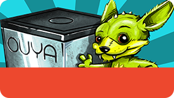

# Enabling Xiaomi Support

While being included in the Xiaomi market is currently an invite-only process, making your app Xiaomi-Enabled is a relatively simple affair.

## Xiaomi Target Hardware

* [MiBox(Enhanced)](http://dev.xiaomi.com/doc/p=3838/index.html)

## Update to the latest ODK

Download latest ODK from the OUYA Developer portal and setup your game to use it.

## Add the necessary files to your build

* Download and extract [SDK_MIBOX_2.0.1](https://ouya-sdks.s3.amazonaws.com/xiaomi/SDK_MIBOX_2.0.1.zip)
* Place **SDK_MIBOX_2.0.1.jar** with the libraries of your game
* Place **MiGameCenterSDKService.apk** in your <game>/assets directory.

## Add the required permissions

Xiaomi's SDK requires several additional permissions in order to work.
```java
	<uses-permission android:name="com.xiaomi.sdk.permission.PAYMENT"/>
    <uses-permission android:name="android.permission.GET_TASKS"/>
    <uses-permission android:name="android.permission.READ_PHONE_STATE"/>
```

## Receipt Checking ##

* If your game has in-app-purchases, be sure to check for receipts when the application starts.
This is important to verify entitlement purchases for premium games and demo games with paid unlock.

## Review the OUYA Everywhere Documentation ##

* Be sure to review the [OUYA Everywhere Documentation](https://github.com/ouya/docs/blob/master/ouya-everywhere.md) for your engine.
The next initialization steps may integrate differently for your particular engine.

## Update your OuyaFacade initialization bundle

The Xiaomi market requires a special application key and ID.  Contact the [OUYA team](mailto:xiaomisupport@ouya.tv) to get these values.

Additionally, non-OUYA markets require being pre-informed about all possible product IDs that might be used during the game's run.  This is so the SDK can do any transforms that are specific to the market that the game is connecting to.

*(Using Java Example)*

```java
	// Your developer id can be found in the Developer Portal
	public static final String DEVELOPER_ID = "00000000-0000-0000-0000-000000000000";

	// Both of these values will be emailed to you by the OUYA team after you've been 
	// selected by the OUYA team
	public static final String XIAOMI_APP_ID = "0000000000000";
	public static final String XIAOMI_APP_KEY = "000000000000000000";

	// All product IDs that might be used
	public static final String[] ALL_PRODUCT_IDS = new String[] {
		"long_sword",
		"sharp_axe",
		"100_extra_lives"
	}

	@Override
	protected void onCreate(Bundle savedInstanceState) {
		Bundle developerInfo = new Bundle();

		// "tv.ouya.developer_id"
		developerInfo.putString(OuyaFacade.OUYA_DEVELOPER_ID, DEVELOPER_ID);
		
		developerInfo.putByteArray(OuyaFacade.OUYA_DEVELOPER_PUBLIC_KEY, loadApplicationKey());

		// We must tell the OuyaFacade that we can use the Xiaomi market for purchases.
		
		// "tv.ouya.xiaomi_app_id"
		developerInfo.putString(OuyaFacade.XIAOMI_APPLICATION_ID, XIAOMI_APP_ID);
		
		// "tv.ouya.xiaomi_app_key"
		developerInfo.putString(OuyaFacade.XIAOMI_APPLICATION_KEY, XIAOMI_APP_KEY);
		
		// "tv.ouya.product_id_list"
		developerInfo.putStringArray(OuyaFacade.OUYA_PRODUCT_ID_LIST, ALL_PRODUCT_IDS);

		OuyaFacade.getInstance().init(this, developerInfo);
		super.onCreate(savedInstanceState);
	}
```

## Disable Screensaver

* The screensaver should be disabled while your game is running. Invoke `View.setKeepScreenOn(true)` to disable the screensaver. Here is a common scenario of an activity loading the layout and using the content View to disable the screensaver.

*(Using Java Example)*

```java
	@Override
	protected void onCreate(Bundle savedInstanceState) {
		super.onCreate(savedInstanceState);
		setContentView(R.layout.activity_main);
		
		FrameLayout content = (FrameLayout)findViewById(android.R.id.content);
		if (null != content) {
			// Disable screensaver
			content.setKeepScreenOn(true);
		}
	}
```

## Create a Xiaomi-specific icon

The application icon on Xiaomi is a little unusual.  It will exist in the xhdpi resolution, but it is not a standard Android icon.

* **res/drawable-xhdpi**:
	* File must be named "ouya_xiaomi_icon.png"
    * 284x160, 32-bit
    * 15px rounded corners 
    * Hero element
    	* Size 284x110
    * Game name
    	* Bottom 50px
    	* Background should be a solid color
    	* No actual text - will be inserted by system at runtime.
    * NOTE: Do NOT update your AndroidManifest.xml to reference ouya_xiaomi_icon - you only need to place the asset in the correct location.
    * See [this example](res/game_tile_alt.png)

	

## Xiaomi requires a .psd image.
* Xiaomi also requires a 800x800 image of the protagonist character(s), or something showing what the game is about.
	* Must be in PSD format.
	* Should be sent directly to the [OUYA team](mailto:xiaomisupport@ouya.tv)

## Localization Resources

Use [Android localization](http://developer.android.com/guide/topics/resources/localization.html) to include a `Simplified Chinese` string resource. [Localization Example](https://github.com/ouya/ouya-sdk-examples/tree/master/Android/AndroidExit)

* `res/values/strings.xml` (Default)

* `res/values-de/strings.xml` (Dutch)

* `res/values-en/strings.xml` (English)

* `res/values-es/strings.xml` (Spanish) 

* `res/values-fr/strings.xml` (French)

* `res/values-it/strings.xml` (Italian)

* `res/values-zh-rCN/strings.xml` (Simplified Chinese)

## Submission

Once the above changes have been made, your updated APK should be submitted via the OUYA Developer portal.  You'll then need to email OUYA at [xiaomisupport@ouya.tv](mailto:xiaomisupport@ouya.tv) to let us know it's ready.  Once you've done that, we'll take a snapshot of the in-app-purchase products that you have and send them to Xiaomi.  Please make sure that you've created any necessary in-app-purchase products **BEFORE** telling us your submission is ready.  This email is also when you should send OUYA your protagonist PSD file.

## TL;DR
	* Update to the latest ODK.
	* Add files to your game project - Xiaomi SDK and Xiaomi's game service apk.
	* Add required permissions to your manifest.
	* Update OuyaFacade's initialization bundle.
	* Create new icon per Xiaomi's requirements
	* Create 800x800 PSD of protagonist.
	* Submit updated apk to OUYA's dev portal
	* Email OUYA to let us know it's ready; include your protagonist PSD.

## That's it!

Wasn't that easy?  :)

## Questions?

If it actually wasn't that easy and you have questions, please don't hesitate to email us at [xiaomisupport@ouya.tv](mailto:xiaomisupport@ouya.tv).
