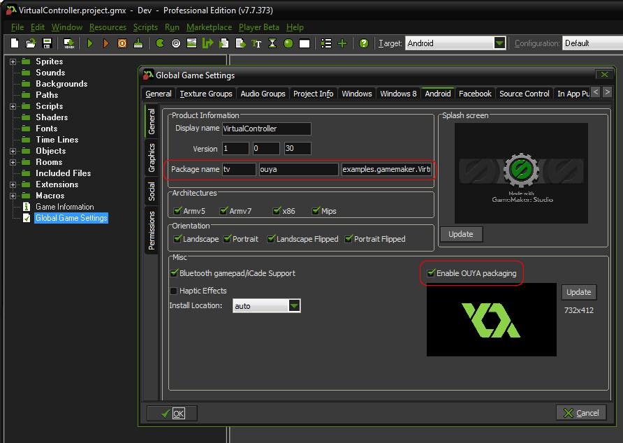

## Game Maker

### Downloads

Open source, clone https://github.com/ouya/ouya-sdk-examples/tree/master/GameMaker

### Forums

@OUYA - (Game Maker on OUYA Forums) - http://forums.ouya.tv/categories/gamemaker-on-ouya<br/>

### Developer Support Hangouts

2013:

<table border=1>
<tr><td>OUYA Hangout July 15th (1:00:00)<br/>
<a href="http://www.youtube.com/watch?feature=player_embedded&v=zWYVYmk6luc" target="_blank">
</a></td> 
<td></td></tr></table>

## Guide

* In your project's `Global Game Settings`, on the `Android` tab enter your `Package name` matching the [developer portal](http://devs.ouya.tv) and check `Enable OUYA packaging`.



* Import the `OuyaSDK Extension` and be sure to download your `signing key` from the [developer portal](http://devs.ouya.tv) and place into the `extensions/OuyaSDK/key.der` project subfolder.


* Select the `Android` target and use the `File` menu and select the `Create Application` menu item to build and deploy to the connected `ADB` device.


## Resources

* Game Maker - http://yoyogames.com/gamemaker/download

* Game Maker Wiki - http://wiki.yoyogames.com/index.php

* Game Maker Studio Setup for Android - http://wiki.yoyogames.com/index.php/GameMaker:Studio_Settings_for_Android

* Create a [Native Extension](http://help.yoyogames.com/entries/30690273) For Android

## Video Tutorials

<b>GameMaker Studio Tutorials</b> - http://www.youtube.com/playlist?list=PLUYhFCYb2qeOBR9AVERSimlZEN-dXCoOW

## Examples

### Virtual Controller

The [Virtual Controller](https://github.com/ouya/ouya-sdk-examples/tree/master/GameMaker/VirtualController.gmx) example shows 4 images of the OUYA Controller which moves axises and highlights buttons when the physical controller is manipulated.


### In-App-Purchases

The [In-App-Purchase](https://github.com/ouya/ouya-sdk-examples/tree/master/GameMaker/InAppPurchases.gmx) example uses the ODK to access gamer info, purchasing, and receipts.


## Xiaomi Initialization

[Back to general info](enable_xiaomi_support.md#xiaomi-initialization)

`OuyaSDK_Init` supports initialization strings to make the game compatible with OUYA Everywhere devices.

* `tv.ouya.developer_id` - The developer UUID can be found in the [developer portal](http://devs.ouya.tv) after logging in.

* `com.xiaomi.app_id` - The Xiaomi App Id is provided by the content team, email `officehours@ouya.tv` to obtain your key.

* `com.xiaomi.app_key` - The Xiaomi App Key is provided by the content team, email `officehours@ouya.tv` to obtain your key.

* `tv.ouya.product_id_list` - The product id list is a comma separated list of product ids that can be purchased in the game.

```gml
purchasables[0] = "long_sword";
purchasables[1] = "sharp_axe";
purchasables[2] = "cool_level";
purchasables[3] = "awesome_sauce";
purchasables[4] = "__DECLINED__THIS_PURCHASE";

strPurchasables = purchasables[0];
for (index = 1; index < array_length_1d(purchasables); ++index)
{
    strPurchasables += ","+purchasables[index];
}

init_ouya_plugin_values = ds_map_create();
ds_map_add(init_ouya_plugin_values, "tv.ouya.developer_id", "00000000-0000-0000-0000-000000000000");
ds_map_add(init_ouya_plugin_values, "com.xiaomi.app_id", "0000000000000");
ds_map_add(init_ouya_plugin_values, "com.xiaomi.app_key", "000000000000000000");
ds_map_add(init_ouya_plugin_values, "tv.ouya.product_id_list", strPurchasables);
OuyaSDK_Init(json_encode(init_ouya_plugin_values));
ds_map_destroy(init_ouya_plugin_values);
```
