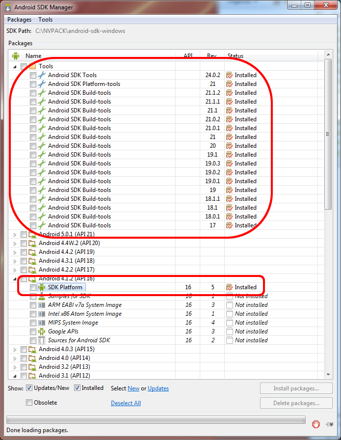
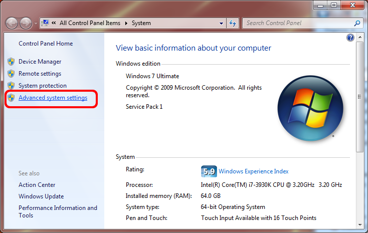
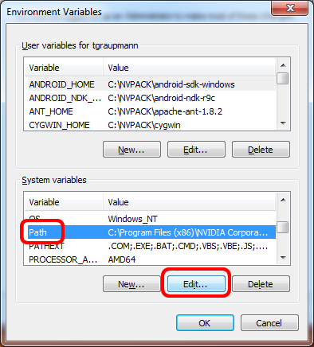
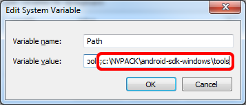

## Setup Instructions for the OUYA ODK

### Videos

<table border=1>

 <tr>

 <td>Windows Driver Setup (10:48)<br/>
<a href="http://www.youtube.com/watch?feature=player_embedded&v=454JFvFTxww" target="_blank">
</a>
 </td>
 
  <td>Mac Driver Setup (5:57)<br/>
<a href="http://www.youtube.com/watch?feature=player_embedded&v=5LSBiNfMq8A" target="_blank">
</a>
 </td>
 
 </tr>
 
 <tr>

 <td>ADB Over Network (1:27)<br/>
<a href="http://www.youtube.com/watch?feature=player_embedded&v=ZAHXESgvkEA" target="_blank">
</a>
 </td>
 
  <td>Check Controller Version (1:01)<br/>
<a href="http://www.youtube.com/watch?feature=player_embedded&v=XTBSXpXnVWg" target="_blank">
</a>
 </td>
 
 </tr>
 
 <tr>

 <td>Check Your Safe Area (3:36)<br/>
<a href="http://www.youtube.com/watch?feature=player_embedded&v=Dz7ZRjN3KlE" target="_blank">
</a>
 </td>
 
 <td>Install Games Remotely (0:55)<br/>
<a href="http://www.youtube.com/watch?feature=player_embedded&v=J5umZxt_KeI" target="_blank">
</a>
 </td>
 
 </tr>
 
 <tr>

 <td>Video Editing in MS Movie (3:45)<br/>
<a href="http://www.youtube.com/watch?feature=player_embedded&v=HI_ekZKfrd4" target="_blank">
</a>
 </td>
 
  <td>Adding Video Screenshots (3:09)<br/>
<a href="http://www.youtube.com/watch?feature=player_embedded&v=l8JRYvy-Gtc" target="_blank">
</a>
 </td>
 
 </tr>
 
 <tr>

 <td>ElGato Capture Setup (4:03)<br/>
<a href="http://www.youtube.com/watch?feature=player_embedded&v=-Igb4IcpbDY" target="_blank">
</a>
 </td>
 
  <td>Mac Overscan Setup (1:07)<br/>
<a href="http://www.youtube.com/watch?feature=player_embedded&v=fwd2a26LOys" target="_blank">
</a>
 </td>
 
 </tr> 
 
</table>

##### Preliminary Instructions

To fully complete the setup, you will need:
* an OUYA
* a computer running Mac OS X or Windows
* a Micro USB to USB cable (or Wifi/Ethernet Connection)

## `JDK6` ##

Java `JDK6` is used in the signing process and the Java runtime is necessary to run the Android SDK. `JDK6` includes useful tools like `jarsigner` which is necessary to sign your Android apps before publishing in the OUYA store.

### Mac OS X ###

[Java for OS X 2014-001](http://support.apple.com/kb/DL1572) includes `JDK6` which is no longer installed by default.

### Windows ###

[JDK6](http://www.oracle.com/technetwork/java/javase/downloads/java-archive-downloads-javase6-419409.html) for Windows is found in an archive section on the Oracle website. Both 32-bit and 64-bit versions of `JDK6` will work.

## `Android SDK` ##

The [Android SDK](http://developer.android.com/sdk/index.html) is necessary for building applications and games on the Android platform.

The `Android SDK` includes useful tools and platform-tools. The Android debugger `adb` has many uses including deploying applications to the OUYA.

`zipalign` is used by engines to package Android apps and games.

`SDK Manager` handles installation and updating the `Android SDK` build tools, packages and platforms.

* Install the `Build Tools` with the SDK platforms for **API 16: Android 4.1 (Jelly Bean)** and **API 21: Android 5.0 (Lollipop)**.



* Install the `Extras\Android Support Library` and `Google USB Driver`.


The marqueed items in red are suggested installs.

On Mac/Linux, you can skip installing the usb driver.

## `ADB` ##

##### ADB Connection method

1. You have the option of connecting with ADB using a micro USB cable.

2. You have the option fo connecting with ADB using tcpip.

* Note: Developer settings allow switching between connection methods in Manage->System->Development->ADB Over Network.

###### ADB Connection TCP/IP

* If connected over the network, you can connect adb with the following command. Where IP:Port come from the settings page.

```
adb connect IP:port
```

###### ADB Connection USB

Before continuing, make sure your OUYA is powered and **not connected to your computer**.

##### Mac OS X

1. Download and install the [Android SDK and tools](http://developer.android.com/sdk/index.html) to your Mac following the included instructions.

2. You will need to add some paths to PATH. Assuming you have put the SDK folder in the location `~/Development/adt-bundle-mac-x86_64`, open a terminal and add the following three lines to your `~/.bash_profile`:

        export PATH=$PATH:~/Development/adt-bundle-mac-x86_64/sdk/tools
        export PATH=$PATH:~/Development/adt-bundle-mac-x86_64/sdk/platform-tools
        export ANDROID_HOME=~/Development/adt-bundle-mac-x86_64/sdk

    You will need to adjust the above paths to match the name of your bundle directory.

    Make sure to `source ~/.bash_profile` once you've made these changes.

3. Launch the Android SDK Manager by running ([detailed instructions](http://developer.android.com/sdk/installing/adding-packages.html)):

        android sdk

    Install the following packages:

    *Note: Some of these packages may be pre-installed with the Android SDK and tools bundle.*  
    **Tools**: Android SDK and Android SDK Platform tools  
	**API 16: Android 4.1 (Jelly Bean)**: SDK Platform (without Google APIs)
	**API 21: Android 5.0 (Lollipop)**: SDK Platform (without Google APIs)
    **Extras**: Android Support Library  

    Install the Java runtime if prompted.  

4. **Important**: There should be no carriage return after the hex value. Any blank lines in this file will result in an error.
Add the following line to `~/.android/adb_usb.ini` (create it if it doesn't exist) for your OUYA console to be recognized:

        0x2836


5. Connect your OUYA to your Mac (Micro USB to USB) then run the following commands:

        adb kill-server
        adb devices

    Your console should be shown in the list of available devices.

##### Windows

* To add the Android SDK to your path go to the `System` in the `Control Panel`.
`Click` on `Advanced System Settings`.



* `Click` on the `Advanced Tab` and `Click` on `Environment Variables`.


* Select `Path` in `System Variables` and `Click` on `Edit`.



* `Paths` are separated with semi-colons and add the full path to the `sdk\platform tools` (the path will depend on where you installed the Android SDK).


* `Paths` are separated with semi-colons and add the full path to the `sdk\tools` (the path will depend on where you installed the Android SDK).
`Click` on `OK`. `Relaunch` the `Command-Prompt` to use the new `path`.



*Windows 8 users:* You will need to disable driver signature verification to install the unsigned Android driver. This involves restarting your PC so do this before you start. See [here](windows8.md) for step-by-step instructions.

1. Download and install the [Android SDK and tools](http://developer.android.com/sdk/index.html) to your PC following the included instructions.

2. Launch **SDK Manager.exe** in the ADT Bundle directory. ([detailed instructions](http://developer.android.com/sdk/installing/adding-packages.html)):

    Install the following packages:

    *Note: Some of these packages may be pre-installed with the Android SDK and tools bundle.*  
    **Tools**: Android SDK and Android SDK Platform tools  
    **API 16: Android 4.1 (Jelly Bean)**: SDK Platform (without Google APIs)
	**API 21: Android 5.0 (Lollipop)**: SDK Platform (without Google APIs)
    **Extras**: Android Support Library  

    Install the Java runtime if prompted.  
    
3. You will need to add some paths to PATH. Assuming you put the ADT bundle at `C:/Development/adt-bundle-windows-x86_64`,

    Open **My Computer**.  
    In the left panel, right-click on **Computer** and choose **Properties**.  
    In the left panel of the new window, choose **Advanced system settings**.  
    Click the button **Environment Variables...** in the new window.
    In the first table (User variables), highlight the row for the **Path** variable.  
    Click the **Edit...** button immediately below the User Variables table.  
    Append the following to the end of the **Variable value** field:  

        ;C:/Development/adt-bundle-windows-x86_64/sdk/tools;C:/Development/adt-bundle-windows-x86_64/sdk/platform-tools
        
    *Note #1: If the Path variable didn't already exist, remove the semi-colon at the beginning.*  
    *Note #2: You will need to adjust the above paths to match the name of your bundle directory.*  
    
    Press OK to save your changes.  
    Press OK to exit the Environment Variables window.  
    Press OK to exit the Advanced System Settings window.

4. Open the `ADT Bundle\sdk\extras\google\usb_driver\android_winusb.inf` file.

5. Add the following lines to the `[Google.NTx86]` and `[Google.NTamd64]` sections:  

        ;OUYA Console  
        %SingleAdbInterface% = USB_Install, USB\VID_2836&PID_0010  
        %CompositeAdbInterface% = USB_Install, USB\VID_2836&PID_0010&MI_01  

6. **Important**: There should be no carriage return after the hex value. Any blank lines in this file will result in an error.
Connect your OUYA to your PC (Micro USB to USB), open Command Prompt (Win+R then type **cmd**), and run the following commands

        adb kill-server  
        echo 0x2836 >> "%USERPROFILE%\.android\adb_usb.ini"  
        adb start-server  

7. Open the Device Manager (Right-click My Computer->Properties->Device Manager)

8. In Device Manager, find **Portable Devices\OUYA Console**. 

9. Right-click and choose **Update Driver Software...**

10. Choose **Browse my computer for driver software** 

11. Choose **Let me pick from a list of device drivers on my computer**

12. On Windows 8, select **All devices** and click **Next**

13. Click **Have Disk** and browse to **Android Bundle\sdk\extras\google\usb_driver**

14. Choose ADB Composite Device
    *The Google device driver is not signed which prevents automatic from finding it.*

15. Accept the unsigned driver

    Your console should be shown in the list of available devices.

##### Eclipse

* Be sure to install the [ADT Plugin](http://developer.android.com/sdk/installing/installing-adt.html) for Eclipse.

First step, turn on line numbers:

```
Window -> Preferences -> General -> Editors -> Text Editors -> Show line numbers.
```

If you're using Eclipse as your development environment, you can create Eclipse projects from the samples included in the ODK to get a working example running quickly.

- Open Eclipse
- From the menu, select **File** > **New** > **Project**
- In the new project dialog, select **Android** > **Android Project from Existing Code**. Click the **Next** button.
- In the **Import Projects** dialog, click the **Browse** button.
- From the file browser that appears, navigate to the root directory of the sample app you want to use. For example, `OUYA-ODK/Samples/game-sample`. Then click the **Open** button.
- In the **Import Projects** dialog, click the **Finish** button.

This will create a working Eclipse project. If your OUYA console is connected, you can run the sample application from the Eclipse menu **Run** > **Run**.

##### Developing with the ODK

Use the min platform with **API 16: Android 4.1 (Jelly Bean)** and the target platform with **API 21: Android 5.0 (Lollipop)** when developing for the Forge TV Console.

In order to use the OUYA API you will need to include `ouya-sdk.jar` in your project libraries.  This can be found in the `libs` directory.

For information on the API commands available, please consult the OUYA API reference documentation.

To run the sample code, open up the project in `iap-sample-app` and follow the instructions in the `README.txt` file.

For your application or game to be recognized as made for OUYA, you will need to include an OUYA intent category on the manifest entry of your main activity. 
Use “tv.ouya.intent.category.GAME” or “tv.ouya.intent.category.APP”.

```xml
<activity android:name=".GameActivity" android:label="@string/app_name">
  <intent-filter>
    <action android:name="android.intent.action.MAIN"/>
    <category android:name="android.intent.category.LAUNCHER"/>
    <category android:name="tv.ouya.intent.category.GAME"/>
  </intent-filter>
</activity>
```

The application image that is shown in the launcher is embedded inside of the APK itself.  The expected file is in res/drawable-xhdpi/ouya_icon.png and the image size must be 732x412.


##### Cleanly shutting down audio

When you exit the app and/or open the system menu, any ongoing game audio should be paused or stopped. Your app is responsible for managing its own audio. Failing to do so may be grounds for review process failure.

When the system overlay menu opens (e.g. when the system button is held or double tapped) the framework broadcasts a sticky intent with the action `tv.ouya.intent.action.OUYA_MENU_APPEARING` (also defined in OuyaIntent). 
You can set up a BroadcastReceiver for this either dynamically or statically.

Statically:

```xml
<application>
    ...
    <receiver android:name=".MyBroadcastReceiver">
        <intent-filter>
            <action android:name="tv.ouya.intent.action.OUYA_MENU_APPEARING" />
        </intent-filter>
    </receiver>
    ...
</application>
```

```java
public class MyBroadcastReceiver extends BroadcastReceiver {
    @Override
    public void onReceive(Context context, Intent intent) {
        if(intent.getAction().equals(OuyaIntent.ACTION_MENUAPPEARING)) {
            //pause music, free up resources, etc.
        }
    }
}
```

Or dynamically:

```java
mContext.registerReceiver(new BroadcastReceiver{
    @Override
    public void onReceive(Context context, Intent intent) {
        //pause music, free up resources, etc.
    }
}, new IntentFilter(OuyaIntent.ACTION_MENUAPPEARING));
```

#### Hardware

Developing for OUYA requires having an OUYA-supported device: an OUYA console, or a M.O.J.O.

You can develop your game on another device, but you will be unable to use the extra functionality included int he ODK without a supported device.  If you need to, you can <a href="http://shop.ouya.tv/">buy one here</a>!

##### Screen Resolution Handling

All applications are provided with a 1080p virtual display for their output. This virtual display is then rendered to the screen in an appropriate manner. This may include downscaling the 1080p display to 720p where the screen does not support 1080p, or to 480p if a screen does not report it supports 720p or 1080p via an HDMI connection.

For OpenGL-based games, we recommend creating a render buffer of 1920x1080 (i.e. 1080p) or 1280x720 (720p). If this does not match the display resolution of your device it will be up or downscaled accordingly by the OUYA. 

Other Android devices may handle resolutions differently, but our store QA process will always test on an OUYA, so it is advisable to test any applications on an OUYA before submitting them to the OUYA store.

For games using the Android UI Framework, the Android documentation from Google at [developer.android.com](http://developer.android.com) provides some useful tips when working with 1080p displays.

##### Video Capture

For capturing video of your game, we recommend using [Elgato](http://www.elgato.com/) and the [capture software](http://www.elgato.com/gaming/game-capture-hd/support/update). Here is a setup and tutorial [video](http://www.youtube.com/watch?v=-Igb4IcpbDY).

##### Documentation

Documentation is a key part of the software development process for apps and games. Markup is a common format for documentation and is also used heavily in the OUYA documentation. [MacDown](http://macdown.uranusjr.com/) is a free markup editor for the Mac.
