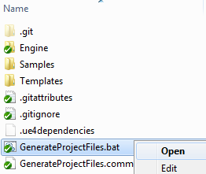
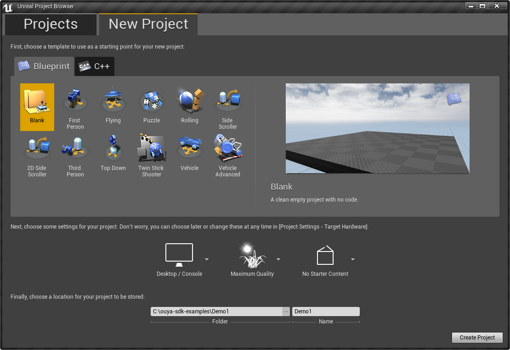
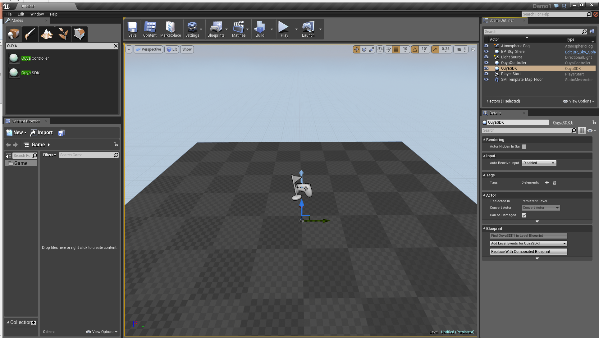
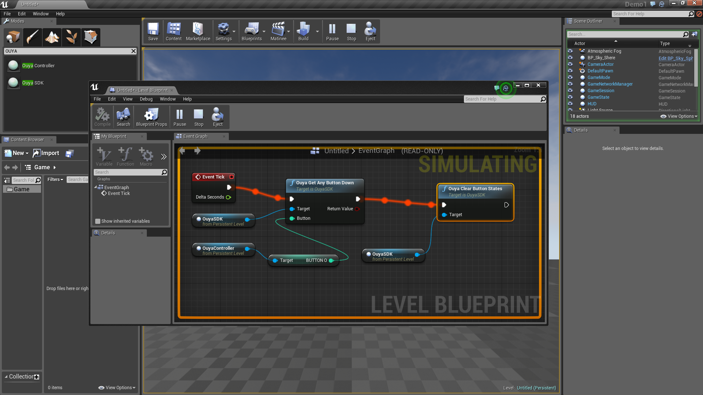

## Unreal Engine

# Forums #

[Unreal on OUYA Forums](http://forums.ouya.tv/categories/unreal-on-ouya)

# Getting Started #

<table border=1>
 <tr>
 <td>UE4 on OUYA (28:49)<br/>
<a href="http://www.youtube.com/watch?feature=player_embedded&v=lK7qGgeuI74" target="_blank">
</a>
 </td>
 <td></td>
 </tr>
</table>

## Quick Start

* First you need an [Unreal subscription](http://unrealengine.com) ($19/month + 5%)

* Link your Github account with your Unreal account per the [wiki instructions](https://wiki.unrealengine.com/GitHub_Setup#GitHub_Account)

* Only after linking your Github account will you have access to the [UE4 Source](https://github.com/EpicGames/UnrealEngine).

* Download the [4.5-OUYA branch](https://github.com/ouya/UnrealEngine/tree/4.5-OUYA) to get the `OUYA fork` of the `Unreal Engine`

```
git clone -b 4.5-OUYA https://github.com/ouya/UnrealEngine
Cloning into 'UnrealEngine'...
remote: Counting objects: 243979, done.
remote: Compressing objects: 100% (53/53), done.
remote: Total 243979 (delta 8), reused 13 (delta 6)
Receiving objects: 100% (243979/243979), 291.48 MiB | 2.50 MiB/s, done.
Resolving deltas: 100% (172998/172998), done.
Checking connectivity... done.
Checking out files: 100% (26995/26995), done.
```

* Download `Required_1of2.zip` and `Required_2of2.zip` from the [4.5.X Releases](https://github.com/EpicGames/UnrealEngine/releases) and unpack in the `UnrealEngine` checkout folder.


* Follow the [Build the Engine](https://wiki.unrealengine.com/GitHub_Setup#Buld_the_Engine) steps to generate the Visual Studio solution.
 


* Open the `UE4.sln` in Visual Studio


* Add `Solution Configurations` and `Solutions Platforms` to the Visual Studio Toolbar to easily target the `UE4` build platforms. 


* Build the `Development Editor` on the `Win64` platform which will build the `UnrealEngine\Engine\Binaries\Win64\UE4Editor.exe` editor application.


* Build the `Development Client` on the `Android` platform which will build the `UnrealEngine\Engine\Binaries\Android\UE4Client-armv7-es2.so` native library.


* Run the script `UnrealEngine\Engine\Binaries\Android\copy_client_for_game.cmd` to copy the native library as the `UE4Game-armv7-es2.so` dependency to use when building BluePrint projects.

 

* Launch the `UE4` editor from `UnrealEngine\Engine\Binaries\Win64\UE4Editor.exe`.


# `UE4 Editor`

* Create a `New Project` as a `Blueprint` project in the `Unreal Project Browser` to publish to `Android` the fastest. Select `No Starter Content` to reduce the file size. Enter a location of an empty folder to place the project and give it a name. Click `Create Project`.



* Use the `Object Browser` and search for `OUYA` to add the `OuyaController` and `OuyaSDK` actors to the level.



* Open the `Level Blueprint`.


* With `OuyaSDK` selected in the `Scene Outliner`, `Right-Click` to add a reference in the `Level Blueprint`.


* With `OuyaController` selected in the `Scene Outliner`, `Right-Click` to add a reference in the `Level Blueprint`.


* Click the `Compile` button to update the latest `Blueprint` changes after adding the `OuyaSDK` and `OuyaController` object references to the `Level Blueprint`.


* `Right-Click` on the `Event Graph` to add an `Event Tick` to the `Level Blueprint`. The event adds an update event to the flow. 


* `Right-Click` on the `Event Graph` while the `OuyaSDK` object in the `Scene Outliner` is selected to add `Ouya Get Any Button Down` to the `Level Blueprint`. The event checks if any controller has a `pressed` event for the `button` parameter. 

## OUYA-Everywhere Input


* `Right-Click` on the `Event Graph` while the `OuyaController` object in the `Scene Outliner` is selected to add `Get BUTTON O` to the `Level Blueprint`. The event gets the `KeyCode` for the `BUTTON_O` on the OUYA Controller. 


* `Right-Click` on the `Event Graph` while the `OuyaSDK` object in the `Scene Outliner` is selected to add `Ouya Clear Button States` to the `Level Blueprint`. The event clears any detected `pressed` and `released` states so the next `Update Tick` can detect the next events.


* Click the `Compile` button to update the latest `Blueprint` changes after adding a set of events that will detect a `pressed` event for the given `button` for any `OuyaController`.


` Click the `Play` button to verify the flow is functioning properly to troubleshoot any issues.



### Examples

Examples are included at the base GIT path.

### Resources

UE3, UnrealScript Forums - http://forums.epicgames.com/forums/350-Unreal-Tournament-3-Programming-amp-Unrealscript<br/>

UDK - http://www.unrealengine.com/udk/downloads/<br/>
UDK Documentation - http://www.unrealengine.com/udk/documentation/<br/>
Getting Started (UDK) - http://udn.epicgames.com/Three/DevelopmentKitGettingStarted.html<br/>
Community Video Tutorials: 65 Videos in a UDK Beginner's series - http://thenewboston.org/list.php?cat=12<br/>
UDK Video Tutorials - http://udn.epicgames.com/Three/VideoTutorials.html<br/>
